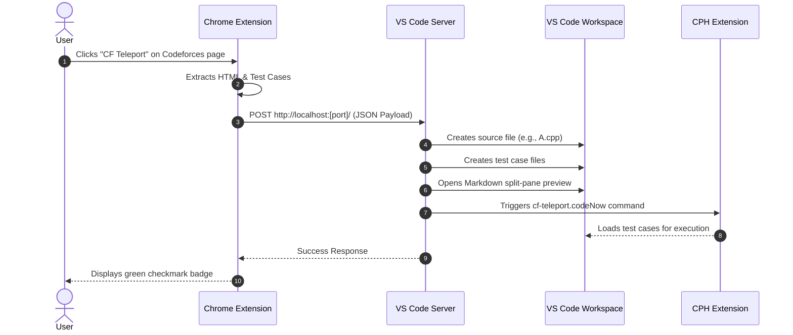

<div align="center">


# ⚡ CF Teleport

**Instantly teleport Codeforces problems and test cases directly to your VS Code environment.**  

A seamless developer tool bridging your web browser and code editor. Click a button on Codeforces, and watch as your VS Code instantly generates the problem files, downloads the sample test cases, and opens a split-pane problem preview.

<br/>


</div>

---

## ✨ Features

- **One-Click Extraction:** Instantly extract problem statements and test cases from any Codeforces problem page directly from your browser.
- **VS Code Integration:** Automatically creates the necessary source code files and test cases in your active VS Code workspace.
- **In-Editor Problem Preview:** Opens a beautifully formatted, split-pane Markdown preview of the Codeforces problem description right next to your code.
- **CPH Ready:** Automatically triggers the Competitive Programming Helper (CPH) extension to run your test cases seamlessly.
- **Robust Port Routing:** Features an enterprise-grade recursive fallback system to gracefully sweep through ports, guaranteeing zero `EADDRINUSE` collisions with CPH or other active VS Code windows.
- **Strict Security (CSP):** Implements a highly secure Content-Security-Policy with cryptographic nonces to prevent Webview XSS, alongside rigorous regex sanitization to block Path Traversal attacks.
- **No IP Bans:** Operates entirely locally between your browser and editor. No excessive API calls or scraping that could trigger a Codeforces IP ban.

---

## 🛠️ Tech Stack

### Chrome Extension (`cf-chrome-extractor`)
- **Core:** Vanilla JavaScript, HTML, CSS
- **API:** Chrome Extensions API (Manifest V3)
- **Permissions:** Minimal (`activeTab`, `scripting`)

### VS Code Extension (`cf-fetcher`)
- **Language:** TypeScript
- **Framework:** VS Code Extension API
- **Data Parsing:** Cheerio (HTML parsing), Markdown-It (Rendering)
- **Networking:** Axios, Local Express/HTTP Server

---

## 📂 Directory Structure

```text
cf-fetcher-official/
├── cf-chrome-extractor/   # The Google Chrome Extension
│   ├── background.js      # Service worker for handling messages
│   ├── content.js         # Content script injected into Codeforces
│   └── manifest.json      # Chrome Extension configuration
│
├── cf-fetcher/            # The Visual Studio Code Extension
│   ├── src/
│   │   ├── extension.ts       # Main VS Code entry point
│   │   ├── server.ts          # Local HTTP server listening for Chrome
│   │   ├── htmlParser.ts      # Cheerio logic to parse CF HTML
│   │   ├── fileManager.ts     # Logic to create files and test cases
│   │   └── editorProvider.ts  # Logic for the custom Problem Preview
│   ├── package.json       # VS Code Extension configuration
│   └── tsconfig.json      # TypeScript configuration
└── README.md
```

---

## 🏗️ Architecture & Data Flow

CF Teleport uses a localized client-server architecture. The Chrome Extension acts as the client scraping the active tab, and the VS Code Extension spins up a lightweight local server to receive the payload.



---

## ⚙️ Local Development Setup

Because this tool bridges two environments, you must run both components.

### 1. The Chrome Extension
1. Open Google Chrome and navigate to `chrome://extensions/`.
2. In the top right corner, turn on **Developer mode**.
3. Click **Load unpacked** and select the `cf-chrome-extractor` folder.

### 2. The VS Code Extension
1. Open the `cf-fetcher` folder in Visual Studio Code.
2. Run `npm install` to install dependencies.
3. Press `F5` to open a new Extension Development Host window.
4. (Optional) Run `npm run watch` to automatically recompile TypeScript changes.

---

## 🚀 Public Deployment

### Chrome Web Store
1. Zip the `cf-chrome-extractor` folder.
2. Go to the [Chrome Developer Dashboard](https://chrome.google.com/webstore/devconsole/).
3. Create a **New Item**, upload your `.zip`, add your generated icons, and submit for review.

### VS Code Marketplace
1. Install the publisher CLI: `npm install -g @vscode/vsce`
2. Configure your `"publisher"`, `"icon"`, and `"repository"` in `cf-fetcher/package.json`.
3. Login via terminal: `vsce login <your-publisher-name>`
4. Inside `cf-fetcher`, run: `vsce publish`

---

## 📝 License
Distributed under the MIT License.
