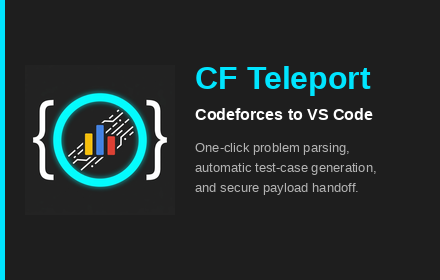

# ⚡ CF Teleport

**Instantly teleport Codeforces problems and test cases directly to your VS Code environment.**  

A seamless developer tool bridging your web browser and code editor. Click a button on Codeforces, and watch as your VS Code instantly generates the problem files, downloads sample test cases, and opens a split-pane problem preview.

 

---

## ✨ Features

- **One-Click Extraction:** Instantly extract problem statements and test cases from any Codeforces problem page directly from your browser.
- **VS Code Integration:** Automatically creates source code files and test cases in your active VS Code workspace.
- **In-Editor Problem Preview:** Opens a beautifully formatted, split-pane Markdown preview of the Codeforces problem description right next to your code.
- **CPH Ready:** Automatically triggers the Competitive Programming Helper (CPH) extension to run your test cases seamlessly.

---

## 🚀 How to Use

1. **Install the Extension:** Install **CF Teleport** in VS Code and install the **CF Teleport Chrome Extension** in Google Chrome.
2. **Open a Workspace:** Open any folder/workspace in VS Code.
3. **Teleport Problems:** Go to any Codeforces problem page in Chrome and click the **CF Teleport** extension icon.
4. **Code & Solve:** Your problem statement `.cf` file and sample test cases will automatically open in VS Code! Click **Code Now → CPH** to start solving.

---

## 📝 License
Distributed under the MIT License.
